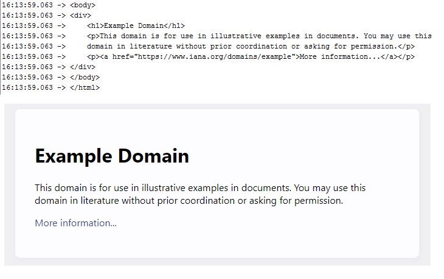

# Tasks:
> **NOTE:** [Your feedback will be greatly appreciated.]

1. Set up the ESP-IDF and build/flash a test app for the module. 
https://docs.espressif.com/projects/esp-idf/en/latest/esp32/

	* Click on Get Started: https://docs.espressif.com/projects/esp-idf/en/latest/esp32/get-started/index.html
	
	* Click on VSCode Extension: https://docs.espressif.com/projects/esp-idf/en/latest/esp32/get-started/vscode-setup.html
	
	* Click on Quick Installation Guide: https://github.com/espressif/vscode-esp-idf-extension/blob/master/docs/tutorial/install.md
	
	Follow the steps:
	
		* In Step 1, Click on Download and install Visual Studio Code: https://code.visualstudio.com/, It takes 15 minutes.
		
		* The rest of steps take a total of 30 minutes.
		
	* Click on basic use: https://github.com/espressif/vscode-esp-idf-extension/blob/master/docs/tutorial/basic_use.md
	
	Follow the steps:
	
		* In Step 8 you will get stuck, because the explanations is not enough. Thus we give some explanations below:
		
		* If in the Get Started page, click on <Start a Project on Windows>, in the appearing page you see the topic "Connect Your Device", in this topic click on <Establish Serial Connection with ESP32>, then you will see a page that says you need either CP210x of FTDI. We bought CP2102. In order for the laptop to recognize CP2102 board, we need to download and install a proper driver. In this page, there is a link <CP210x USB to UART Bridge VCP Drivers> to download the driver but in Windows 7 it doesn't work. So I downloaded the proper driver from https://www.pololu.com/docs/0J7/all by following its instructions.
		
		* Note: after installing the driver, when you enter <ESP-IDF: Select port to use> command in Command Palette in Visual studio, the connected com-port automatically appears in the textbox above, just must click on it do.

		* In Step 9, select UART.

2. Example:
https://github.com/espressif/vscode-esp-idf extension/blob/master/docs/tutorial/basic_use.md
--------------------------------------------------------------------------------------------------------------
3. Set up the WiFi Station interface and HTTP client.
	* follow this link: https://github.com/espressif/esp-idf/tree/master/examples/wifi/getting_started

	* Some times before flashing the module you need to reset the device by pressing the button on it.
	* After flashing, disconnect the jumper, click on the monitor icon (below the VScode window), reset the module again.
	* To access the menuconfig, just search this work in the command palatte in the view menu.
--------------------------------------------------------------------------------------------------------------
4. Run esp-dl with face detection and face recognition model.
https://github.com/espressif/esp-dl

	* You need to install C/C++ extension, thus download it from the extansions menu on the sied bar.
	* You need a C++ compiler on Windows, so follow the link https://code.visualstudio.com/docs/languages/cpp
	
	* Main command to install C++ compiler (interpreter) is `(pip install opencv-python)`. This command should be run in cmd terminal.
	
	* Image size is very important. It must be less than 2 MB to be processed in ESP32.
	* Sometimes you get "build error", in this situation delete build folder, check that the name of folders be in english, build the project again.
--------------------------------------------------------------------------------------------------------------
5. Send detected face and identity vector to the server via rest API.
	* To setup ESP32 webserver follow this link:
	https://www.hackster.io/Arnov_Sharma_makes/esp32-cam-web-server-and-getting-started-guide-f1a04a
	

	
	

	
	* I have run http client example. Here is the result (the figure above is what we see in serial monitor of ESp 32, the figure below is what we see in Chrome browser of http://example.com/index.html):
	

	
	

	* Here is a simple but amazing project with this module (turning an LED on and off remotely): 	
	https://randomnerdtutorials.com/esp32-web-server-arduino-ide/
--------------------------------------------------------------------------------------------------------------
6. Set up the Edge Impulse framework 
	**Note:** I've done this task in Ubuntu 20 because Nodejs v14 which is the least required version of Nodejs for Edge Impulse Cli is not supported in Winsows 7. 
	**Note:** Go to the highest directory. Enter `cd ..` muliple times.
	* Follow this link:
	* https://docs.edgeimpulse.com/docs/development-platforms/officially-supported-mcu-targets/espressif-esp32
	* In Step 3, from the address https://docs.edgeimpulse.com/docs/edge-impulse-cli/cli-installation
	* Instead of `npm install -g edge-impulse-cli` run the command below:
	* `sudo npm install -g edge-impulse-cli --unsafe-perm=true –allow-root`
	* When you want to install esptool, you need the name of the PORT that CP2102 is connected to. To obtain the port name type this command in the terminal: `dmesg | grep tty`. Fortunately, in Ubuntu the driver for CP2102 has already been installed. My port nane was "ttyUSB0". If you get the error that says there is no such file "ttyUSB0", it is beacause you are in the Users directory. Port names are some files in /dev/ directory. Thus to get rid of this error, navigate to the highest directory. Enter `sudo su' to have admin permisions, then re-enter `pip install esptool` then `esptool.py -p ttyUSB0 flash_id`
	* There is no problem with `sudo apt install screen`
	* You should download and unzip "Edge impulse firmware"
	* Now we have to run "flash_linux.sh" file. Fist, I entered `esp32/espressif-esp32/flash_linux.sh` then I entered `/home/ali/Downloads/espressif-esp32/espressif-esp32/flash_linux.sh`
	* Enter `edge-impulse-daemon` command, then enter username and password for your account. 
	* when the computer tries to connect to ESP32, disconnect GPIO0-GND jumper.
	* In yuour Edge Impulse account, the device is added. 

